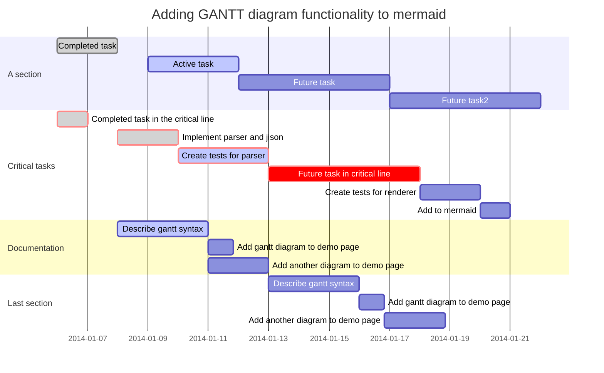

# xk6-tcp
* TCP extension components used in K6
* Link: https://k6.io/blog/extending-k6-with-xk6/#creating-the-k6-extension


## Building the extension with xk6
```
First install xk6 with:
$ go install github.com/k6io/xk6/cmd/xk6@latest

Next, let's build the k6 binary. To use the published version of the extension run:
$ xk6 build v0.32.0 --with github.com/shanyongsy/xk6-tcp

Or if you're working with a local directory run the following, replacing the path as needed:
$ xk6 build v0.32.0 --with github.com/shanyongsy/xk6-tcp="/home/shanyong/code/k6code/tcp-extension/xk6-tcp
```

## K6 Script
[k6-tcp script example](https://github.com/shanyongsy/xk6-tcp/blob/main/example/loadtest/test_tcp.js)

## Tcp Server
[Test server](https://github.com/shanyongsy/tcp-server-client-go)


